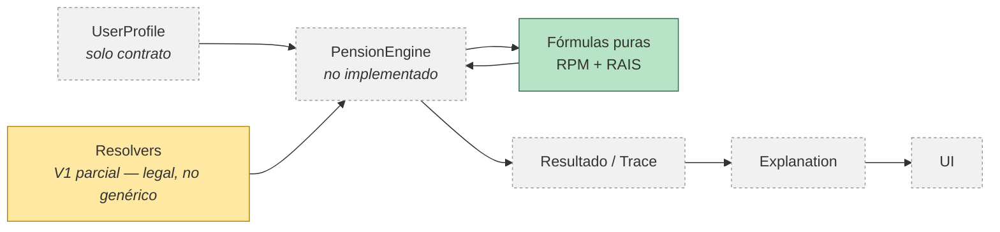

# PensionLab

PensionLab es una plataforma para modelar, simular y explicar el sistema pensional
colombiano (RPM y RAIS).

## Estado del proyecto

🚧 Sprint 1 completo — arquitectura, contratos de datos y fórmulas de cálculo
(RPM/RAIS) implementadas y probadas. Todavía sin interfaz de usuario ni motor de
cálculo de punta a punta.

## Arquitectura, de un vistazo



## Filosofía del proyecto

- Un número sin explicación no sirve — cada resultado debe poder rastrearse hasta
  la norma, el supuesto o la fórmula que lo produjo.
- Lo legal, lo asumido y lo calculado se mantienen separados y visibles, nunca
  mezclados.
- Preferimos ser honestos sobre lo que no sabemos (una tasa incierta, una norma en
  disputa) antes que mostrar una falsa precisión.
- Se documenta antes de construir, no al revés.

## ¿Qué hace PensionLab?

Ayuda a una persona a simular su pensión bajo los dos regímenes del sistema
colombiano — RPM (Régimen de Prima Media) y RAIS (Régimen de Ahorro Individual) —
y a entender de dónde sale ese número, no solo a obtenerlo. Su arquitectura fue
diseñada para evolucionar junto con futuras reformas y cambios normativos sin
tener que reescribir el núcleo del sistema.

## Qué funciona hoy / qué no

| | Estado |
|---|---|
| Fórmulas de cálculo RPM y RAIS (puras, con 18/18 tests) | ✅ |
| Resolución de normativa por fecha | ✅ (versión inicial, no genérica) |
| Motor de cálculo (`pensionEngine`) | ❌ no implementado |
| Supuestos de RAIS poblados en datos reales | ❌ pendiente |
| Interfaz de usuario | ❌ no implementada |
| Simulación de punta a punta | ❌ no disponible todavía |

## Arquitectura

El proyecto separa estrictamente tres cosas que suelen mezclarse: la fórmula
matemática, la norma legal que fija sus parámetros, y los supuestos de modelado
donde la ley no llega. Cada cálculo queda trazado hasta su fuente y cada
simulación es reproducible en el tiempo. El detalle completo vive en
`docs/tecnico/arquitectura/`.

## Estructura del proyecto

```
src/
├── domain/       # fórmulas puras, motor de cálculo, contratos, transparencia
├── data/         # normas legales y supuestos de modelado, versionados
├── models/       # UserProfile, Simulation
├── context/      # estado de React
├── components/   # UI (formularios, resultados)
└── pages/        # páginas del wizard
```

## Cómo correr el proyecto

```
npm install
npm run dev      # servidor de desarrollo
npm run test     # suite de Vitest
npm run build    # build de producción
npm run lint     # ESLint
```

## Documentación

- [Resolver Legal Genérico](docs/tecnico/arquitectura/resolver-legal-generico.md)
- [Plan de prerrequisitos de `pensionEngine`](docs/tecnico/arquitectura/plan-implementacion-prerrequisitos-pension-engine.md)
- [Implementación de fórmulas RAIS](docs/tecnico/implementacion-formulas-RAIS.md)
- [Trazabilidad normativa (`data/legal`)](src/data/legal/trazabilidad-normativa.md)
- [Trazabilidad de fórmula RPM](src/domain/formulas/trazabilidad-formula-RPM.md)
- [Trazabilidad de fórmula RAIS](src/domain/formulas/trazabilidad-formula-RAIS.md)
- [Cierre de Sprint 1](docs/gestion/cierre-sprint-1.md)

## Advertencias

- PensionLab es una herramienta de simulación y aprendizaje, no asesoría
  financiera, legal ni pensional oficial.
- El proyecto está en desarrollo activo: hoy tiene su arquitectura y sus fórmulas
  de cálculo definidas, pero todavía no ofrece una simulación de punta a punta ni
  interfaz de usuario.
- Los supuestos, fuentes legales y limitaciones específicas de cada cálculo están
  documentados en detalle en `docs/` — no se repiten aquí, para mantener este
  README enfocado.

## Roadmap

Sprint 2 continúa con los 10 pasos de prerrequisitos de `pensionEngine` (ver el
[plan de implementación](docs/tecnico/arquitectura/plan-implementacion-prerrequisitos-pension-engine.md))
hasta tener un cálculo real de punta a punta.

## La documentación es parte del producto

En PensionLab, la documentación no es un anexo interno — es parte de lo que el
proyecto ofrece. Cada decisión de arquitectura, cada fuente legal, cada supuesto y
cada limitación está documentada en `docs/` con el mismo cuidado que el código. Si
el código responde *cuánto*, la documentación responde *por qué* — y ambas
respuestas son parte del producto.

## Autoría

Carlos Peraza — proyecto personal en desarrollo.
