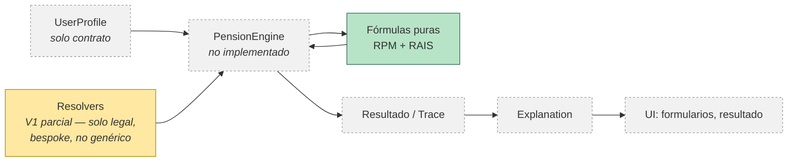

# Cierre de Sprint 1 — PensionLab

## Estado general

Sprint 1 terminó siendo, en la práctica, un sprint de **arquitectura y fundamentos**,
no el sprint de "wizard + cálculo funcionando" que se planteó originalmente. Esto se
dice explícitamente en la sección de riesgos — es un cambio de alcance real, no un
detalle menor.

## Objetivos alcanzados

- Arquitectura funcional V1.0 diseñada y aprobada: módulos, flujo de usuario, modelo
  de datos, separación interfaz/lógica/datos legales, recomendaciones de seguridad y
  privacidad.
- Módulo de Transparencia (`LegalExplanation`) incorporado a la arquitectura desde el
  diseño, no como añadido posterior.
- Contratos de datos definidos y documentados: `CalculationTrace`, `Explanation`,
  `PensionCalculationResult`, `UserProfile`, `Simulation`.
- Separación estricta `data/legal` (normas obligatorias) vs. `data/assumptions`
  (supuestos de modelo), con esquemas versionados de entradas individualmente
  trazables.
- Matriz de trazabilidad normativa completa: 12 de 13 campos legales validados
  contra fuente oficial (Ley 100/1993, Ley 797/2003, Sentencia C-197/2023); 1 campo
  (SMLV) bloqueado por litigio activo, documentado y no cargado como firme.
- Hallazgo y documentación de una controversia legal real (ancla del incremento de
  tasa de reemplazo en RPM: interpretación de Colpensiones vs. alternativa
  favorable), con decisión de producto explícita y trazable.
- `vigente-2026.json` construido como borrador bloqueado, con 13 entradas legales
  verificadas.
- Resolver legal V1 implementado y probado (`resolverReglasVigentes`,
  `obtenerSemanasMinimas`), manejando vigencia por fecha, estado jurídico
  (`estadoJuridico`), y el cronograma progresivo de C-197/2023.
- Fórmulas puras RPM y RAIS implementadas, documentadas y probadas —
  **18/18 tests unitarios en verde** (`npm run test`).
- Vitest incorporado al proyecto como framework de pruebas (no existía antes).
- Revisión arquitectónica crítica a 10 años realizada, con riesgos y acoplamientos
  concretos identificados antes de escribir `pensionEngine`.
- Diseño aprobado del Resolver Legal genérico y el Resolver de Supuestos como
  componentes separados; decisión explícita de diferir el Motor de Reglas hasta que
  exista un segundo caso real de lógica condicional compleja.
- Plan de implementación de 10 pasos para los prerrequisitos de `pensionEngine`,
  con los Principios de Arquitectura de PensionLab documentados por primera vez.

## Decisiones arquitectónicas tomadas

1. `UserProfile` y `Simulation` separados: identidad estable vs. snapshot de cálculo.
2. Transparencia como módulo central desde el diseño, no opcional.
3. `data/legal` versionado con histórico; la reforma pensional 2024 se mantiene
   excluida de la resolución "vigente" mientras siga suspendida por la Corte
   Constitucional.
4. Separación de tres capas: fórmula matemática (`domain/formulas`) / norma legal
   (`data/legal`) / supuesto de modelo (`data/assumptions`).
5. RAIS nombrado explícitamente como proyección, no cálculo
   (`calcularProyeccionRAIS`, `Simulation.resultadoBase.proyeccionRAIS`).
6. `moneda`/`baseValor`/`periodoReferencia` en `PensionCalculationResult`,
   separados de `fechaCalculo`/`versionNormativa` (que viven solo en
   `Simulation.metadata`) para evitar fuentes de verdad duplicadas.
7. `gradoEstimacion` agregado a `Explanation` para reflejar la incertidumbre de una
   proyección, distinto de la confiabilidad del sistema.
8. `semanasMinimasPension` dividido por sexo tras el hallazgo de la Sentencia
   C-197/2023 — un hallazgo estructural, no solo un dato.
9. Mecanismo `estadoJuridico` (`firme`/`transitorio`/`suspendido`) para manejar
   incertidumbre jurídica activa sin bloquear el desarrollo (caso SMLV 2026).
10. Separación `datosUsuario` / `parametrosLegales` / `parametrosSupuestos` en las
    fórmulas puras.
11. Estándar de documentación de arquitectura adoptado: Principios, Diagrama
    general, Objetivo, Diseño, Riesgos, Decisiones, Próximos pasos.
12. Resolver Legal y Resolver de Supuestos diseñados como componentes
    independientes — mismo mecanismo interno, sin compartir fuente ni manifiesto.

## Entregables

**Arquitectura y planeación**
- Propuesta de arquitectura V1.0 (módulos, flujo, modelo de datos, capas, seguridad)
- Plan técnico de Sprint 1
- `docs/tecnico/arquitectura/resolver-legal-generico.md`
- `docs/tecnico/arquitectura/plan-implementacion-prerrequisitos-pension-engine.md`
- `docs/tecnico/implementacion-formulas-RAIS.md`

**Contratos y esquemas**
- `src/domain/contracts/{CalculationTrace,Explanation,PensionCalculationResult}.js`
- `src/models/{UserProfile,Simulation}.js`
- `src/data/legal/schema.js`, `src/data/assumptions/schema.js`

**Datos legales**
- `src/data/legal/trazabilidad-normativa.md`
- `src/data/legal/versions/vigente-2026.json` (borrador bloqueado)
- `src/data/legal/index.js` (resolver V1)

**Fórmulas y pruebas**
- `src/domain/formulas/{formulaRPM,formulaRAIS}.js`
- `src/domain/formulas/{trazabilidad-formula-RPM,trazabilidad-formula-RAIS}.md`
- `src/domain/formulas/{formulaRPM,formulaRAIS}.test.js` — 18/18 en verde
- Vitest configurado (`package.json`)

**Estructura de proyecto**
- Árbol completo de carpetas `domain/`, `data/`, `models/`, `context/`,
  `components/`, `pages/`, con responsabilidades documentadas por archivo.

## Riesgos y pendientes

- **El SMLV 2026 sigue bajo litigio** ante el Consejo de Estado — bloqueado por
  diseño (`estadoJuridico: 'transitorio'`), sin resolver.
- **La reforma pensional 2024 sigue suspendida** por la Corte Constitucional — fuera
  de `vigente-2026.json` por decisión explícita, pendiente de fallo definitivo.
- El resolver legal actual es todavía específico por campo
  (`obtenerSemanasMinimas`), no genérico — el plan de 10 pasos ya lo cubre, pero
  nada de eso está implementado todavía.
- `data/assumptions` sigue sin resolver (`resolverSupuestosVigentes` no
  implementado) y sin datos poblados (`supuestos-v1.json` vacío).
- **No existe cálculo de IBL** — bloqueo explícito y ya identificado para
  `pensionEngine`.
- `pensionEngine` no está implementado — **ningún cálculo real de pensión es
  posible todavía de punta a punta**.
- **La UI no tiene ninguna pieza funcional** — todos los componentes
  (`ConsentModal`, formularios, panel de resultados) siguen siendo archivos vacíos
  con solo un comentario de responsabilidad.
- `README.md` tiene una regresión sin comitear (ver nota al inicio de este cierre) —
  pendiente de tu decisión antes del commit de cierre.
- La interpretación adoptada para el ancla del incremento RPM (1300 semanas fijo)
  es una decisión de producto, no una posición jurídica definitiva — sigue abierta
  la disputa interpretativa real.
- Los criterios de cierre originalmente definidos para Sprint 1 (wizard de 3 pasos,
  pantalla de resultado, consentimiento, lint/build limpios) **no se cumplieron** —
  el sprint se reorientó hacia fundamentos de arquitectura y datos legales. Lo dejo
  explícito para que la decisión de haber reorientado el alcance quede documentada,
  no implícita.

## Objetivos propuestos para Sprint 2

Dos caminos posibles — recomiendo A antes que B, pero es una decisión de prioridad
que te corresponde a ti:

**A. Completar los prerrequisitos y construir `pensionEngine`** (continuación directa
del plan ya aprobado): pasos 1-10 de `plan-implementacion-prerrequisitos-pension-engine.md`,
terminando en un cálculo real de punta a punta (aunque sea invocable solo por
tests, sin UI todavía).

**B. Construir la UI mínima** (wizard de 3 pasos + pantalla de resultado), incluso
contra datos parciales o simulados, para tener algo demostrable antes de terminar
toda la profundidad de `pensionEngine`.

Mi recomendación es A primero — es la continuación natural de lo que ya está en
curso y evita construir UI sobre un motor de cálculo que todavía va a cambiar de
forma (resolvers genéricos, migración de esquema). B se volvería el sprint
siguiente, ya con un motor de cálculo estable debajo.
