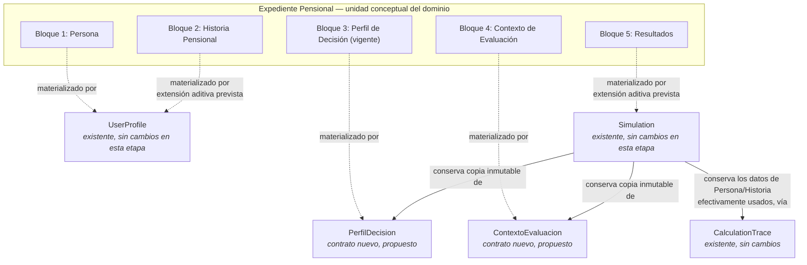
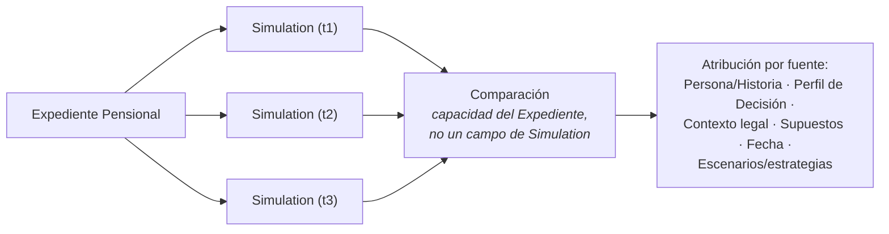

# Diseño: Expediente Pensional

## Principios aplicables

Este documento no introduce principios nuevos — aplica y, en varios casos, refuerza los
[Principios de Arquitectura de PensionLab](plan-implementacion-prerrequisitos-pension-engine.md#principios-de-arquitectura-de-pensionlab)
ya vigentes desde Sprint 1:

- **Principio 1** (separación legal/asumido) — se preserva dentro del Bloque 4: el
  Contexto de Evaluación nunca fusiona normas y supuestos en un solo objeto.
- **Principio 3** (trazabilidad hasta el origen) y **Principio 6** (simulación como
  snapshot inmutable y reproducible) — se refuerzan al dar forma explícita a lo que hoy
  vive disperso entre `Simulation.metadata` (solo ids de versión) y
  `CalculationTrace.datosUsados` (solo el bulto de parámetros usados).
- **Principio 5** (limitaciones declaradas, no ocultas) — condiciona directamente el
  diseño de la capacidad de [Comparación](#capacidad-de-comparación).
- **Principio 7** (RAIS es proyección, nunca cálculo definitivo) — debe preservarse en
  cualquier vista futura que compare resultados RPM y RAIS lado a lado.
- **Principio 8** (documentar antes de implementar) — este documento es la aplicación
  directa de ese principio al concepto de Expediente.
- **Principio 9** (generalizar con evidencia, no por anticipación) — es la razón por la
  que la Brújula Pensional y la cuantificación exacta de Comparación quedan
  explícitamente fuera de esta versión (ver [Alcance de esta versión](#alcance-de-esta-versión)).
- **Principio 10** (minimización de datos personales) — tensiona con la idea de una
  clave de identidad natural para la persona; se deja pendiente, no se resuelve aquí
  (ver [Riesgos](#riesgos)).

## Diagrama general

**Expediente Pensional como unidad conceptual, y los objetos que materializan cada bloque:**

**Comparación como capacidad separada, operando sobre Simulations ya realizadas:**

`escenarios[]` no aparece en este segundo diagrama a propósito: sigue siendo una
capacidad **dentro** de una misma `Simulation` (mismo Contexto de Evaluación, mismo
momento), mientras que Comparación opera **entre** `Simulation` distintas.

## Objetivo

Formalizar el Expediente Pensional como la raíz de agregado y unidad conceptual central
del dominio de PensionLab — el "caso completo" que el sistema analiza — sin reemplazar
ningún contrato ya validado en Sprint 1. El Expediente compone lo que hoy existe
(`UserProfile`, `Simulation`) y da nombre y forma a dos conceptos que hoy solo están
insinuados o dispersos (Perfil de Decisión, Contexto de Evaluación), además de anticipar
una capacidad nueva (Comparación) que no tiene lugar hoy en la arquitectura.

## Alcance de esta versión

**Sí incluye:**
- El modelo conceptual del Expediente Pensional y sus 5 bloques.
- El mapa de qué objeto o contrato materializa cada bloque (existente, extendido o
  nuevo).
- Las ubicaciones propuestas para los contratos nuevos.
- El contrato mínimo (cualitativo) de la capacidad de Comparación.
- Las decisiones arquitectónicas tomadas y los pendientes explícitos que quedan
  abiertos.

**No incluye — queda explícitamente fuera de esta versión:**
- La forma física de almacenamiento o persistencia del Expediente.
- Validaciones en tiempo de ejecución sobre cualquiera de los bloques o contratos.
- El diseño del cálculo de IBL.
- El contrato detallado de la Brújula Pensional.
- La implementación de los motores de viabilidad, estrategias o comparación — solo se
  define aquí la forma cualitativa del contrato de Comparación, no su lógica.
- Cualquier modificación a `UserProfile.js`, `Simulation.js` o a los contratos
  existentes en `domain/contracts/` — este documento solo **describe** extensiones
  aditivas previstas; no las implementa.

## Diseño — los 5 bloques

### Bloque 1: Persona

Información estable del afiliado. Se materializa hoy en `UserProfile.personalInfo`
(`fechaNacimiento`, `sexo`), reutilizado **sin ningún cambio**.

### Bloque 2: Historia Pensional

Semanas, IBC, régimen, traslados, bonos, historia laboral y demás antecedentes. Se
materializa hoy parcialmente en `UserProfile.laboralInfo`
(`regimenActual`, `semanasCotizadas`, `fechaInicioCotizacion`, `salarioActual`,
`historialIBC`). Se prevé una **extensión aditiva futura** —no realizada en esta
etapa— para incorporar `traslados` (cambios de régimen RPM↔RAIS) y `bonos`
(bonos pensionales), ambos ausentes hoy del contrato.

#### Niveles de madurez de la información pensional

Registrado tras el análisis de brecha hacia el primer resultado económico de
PensionLab (Sprint 3, agosto 2026), a partir de una tensión que ya había aparecido
sin resolverse en tres lugares del código: la ayuda de la pregunta de semanas en
`InformacionPensionalEsencial.jsx` y el Tiempo 2 de `HistoriaPensional.jsx`
prometen ambas, en distintas palabras, que *"más adelante podremos
verificar/validar esto con tu historia laboral oficial"* — sin que nada definiera
qué significa ese "más adelante"; y `Explanation.gradoEstimacion`
(`domain/contracts/Explanation.js`, Sprint 2, nunca instanciado) ya reserva un
campo para expresar exactamente este tipo de confianza, citando en su propio
JSDoc "falta de historial de IBC completo" como ejemplo, sin que ningún código lo
haya llenado de contenido todavía.

Este marco extiende, a nivel de todo el Bloque 2, el mismo patrón que Sprint 3 ya
usa a nivel de un solo campo (`certezaSemanas`: conocido/aproximado/desconocido,
en `evaluarSemanasMinimas`) — no introduce un concepto ajeno al proyecto, nombra
uno que ya existía disperso.

- **Nivel 1 — Información autodeclarada.** Datos ya capturados hoy por Sprint 3:
  fecha de nacimiento, sexo, régimen, semanas cotizadas (con su propia
  certeza), y —desde el Slice "Base actual de cotización"— la base sobre la
  que la persona cotiza hoy. Este último dato no se guarda como un número
  suelto: `determinarBaseCotizacion.js` conserva por separado
  `ibcActualDeclarado`/`ibcActualCalculado` (el valor original, nunca
  sobrescrito) e `ibcAplicableSimulacion` (después de ajustes trazados en
  `ajustesAplicados`), junto con `origenDatoIbc` y `certezaValorDeclarado` —
  el mismo tipo de separación entre dato y certeza que ya motivó este marco de
  niveles. Datos autodeclarados **todavía sin capturar, previstos para el
  siguiente Slice de la secuencia económica**: edad de jubilación deseada. Lo
  ya capturado habilita las evidencias de elegibilidad ya construidas
  (semanas mínimas, edad de pensión, indicios de régimen de transición); una
  primera estimación de monto (RAIS/RPM mínimos) queda habilitada recién
  cuando se complete también la meta de jubilación. En ningún caso, dentro de
  este nivel, hay datos verificados contra una fuente oficial.
- **Nivel 2 — Historia laboral oficial (verificada, no solo resumida).** El
  usuario aporta o el sistema consulta su historial real de cotizaciones —
  fechas exactas por período, no un número autorreportado. Mejora: la certeza
  de `semanasCotizadas` deja de depender de "aproximado"; permite validar si
  realmente hubo traslado de régimen (hoy `evaluarIndiciosTransicion` no puede
  evaluar ese efecto — es justo la pieza que lo desbloquearía). No resuelve IBL
  con precisión por sí solo si no incluye los IBC históricos, solo fechas y
  semanas.
- **Nivel 3 — Evolución histórica de salario/IBC.** El sistema conoce el IBC
  mes a mes (o año a año) de la ventana relevante. Es la única pieza que
  habilita el cálculo real de IBL, reemplazando el proxy del Nivel 1. RAIS
  mejora, pero su techo de confianza permanece en "media": depende de
  rentabilidad futura proyectada, algo inherente a cualquier proyección, no
  resoluble con más historia.
- **Nivel 4 — Saldo actual de la cuenta individual (solo aplica a RAIS).**
  Resuelve la limitación ya documentada como "la más importante de todo el
  documento" en `trazabilidad-formula-RAIS.md` (RAIS hoy no incluye capital ya
  acumulado). Fuente de dato distinta (consulta a la AFP), no una extensión de
  los niveles 1-3.

**Uso previsto:** `Explanation.gradoEstimacion.nivel`/`.motivo`, cuando se
implemente, debe poblarse a partir de este marco — no como un juicio ad-hoc por
cálculo. Sirve además como respuesta explícita a las dos promesas de "más
adelante" ya hechas al usuario en pantallas de Sprint 3: ese "más adelante" es
el Nivel 2.

**Pregunta de producto registrada, deliberadamente sin resolver:** "Nivel
1/2/3/4" es lenguaje útil para la arquitectura, pero no se ha decidido si debe
llegar así de literal a la interfaz. Antes de diseñar cómo PensionLab comunica
el grado de confianza de un resultado, debe revisarse si conviene traducirlo a
un concepto orientado a la experiencia (ej. "calidad del análisis", "precisión
del análisis", o una idea equivalente) en vez de exponer la numeración interna
directamente al usuario. No decidido — queda para cuando se diseñe esa
comunicación.

Distinción confirmada durante la implementación de "Base actual de
cotización" (corrige la formulación anterior de este párrafo, que hablaba de
`gradoEstimacion` a nivel de un dato individual): la **calidad de un dato
capturado** (`origenDatoIbc`, `certezaValorDeclarado`, `confianzaReglaAplicada`)
vive junto a ese dato, en el Slice que lo captura — nunca deriva ni produce
`gradoEstimacionResultado` por sí sola. `Explanation.gradoEstimacion` sigue
siendo, sin excepción, una síntesis de **toda una `Simulation`** (todos los
insumos combinados, no un dato aislado), que solo el futuro Motor de
Explicabilidad puede construir — ver `determinarBaseCotizacion.js` para el
razonamiento completo de esta separación. Lo que sí corresponde
inequívocamente al Nivel 1 es la información que alimentará esa síntesis
cuando exista: ninguno de los datos capturados hasta ahora está verificado
contra una fuente oficial. El **texto literal que verá el usuario** para
comunicar esta calidad permanece abierto, tal como ya registraba este
documento — se decide al diseñar esa comunicación, no aquí.

### Bloque 3: Perfil de Decisión

Objetivos, restricciones, preferencias, prioridades y horizonte temporal definidos por
el usuario. Es un concepto nuevo — hoy solo existe disuelto y parcial en
`Simulation.simulacionInput` (`edadJubilacionDeseada`, `ahorroVoluntarioMensual`).

Se propone un contrato nuevo, `PerfilDecision`, con las siguientes reglas confirmadas:

- El Expediente mantiene **un único Perfil de Decisión vigente a la vez**, con un
  objetivo principal y varias restricciones/preferencias/prioridades.
- Las alternativas que se quieran explorar simultáneamente (ej. pensionarse a los 62
  frente a los 65) se representan como **escenarios o estrategias derivados de ese
  mismo perfil vigente** — nunca como varios perfiles vigentes en paralelo.
- Cuando el usuario cambia realmente su objetivo o sus prioridades, se actualiza el
  Perfil de Decisión vigente del Expediente.
- Cada `Simulation` conserva una **copia completa e inmutable** (embebida, no
  referenciada) del Perfil de Decisión efectivamente usado en esa ejecución —mismo
  criterio de trazabilidad que ya aplica hoy `CalculationTrace.datosUsados`— de manera
  que las simulaciones anteriores sigan siendo reproducibles y auditables aunque el
  perfil vigente cambie después.

### Bloque 4: Contexto de Evaluación

Legislación vigente, parámetros legales, supuestos, SMLMV, fechas de vigencia y demás
información utilizada por el análisis. **Este bloque no pertenece al usuario** — es el
puente resuelto entre `data/legal` + `data/assumptions` (vía sus Resolvers) y el motor
de cálculo.

Se propone un contrato nuevo, `ContextoEvaluacion`, que:
- Conserva, por cada `Simulation`, una **copia completa de los valores efectivamente
  resueltos** por los Resolvers Legal y de Supuestos para la fecha de esa ejecución
  (ej. el valor numérico de `smlv` usado, no solo su id de entrada) — **no
  referencias, ids de versión, ni información que deba resolverse nuevamente** para
  reproducir la simulación. Mismo criterio de copia embebida e inmutable que ya aplica
  al Perfil de Decisión (Bloque 3).
- Preserva internamente la separación entre normas y supuestos (Principio 1) — nunca
  los funde en un solo objeto.
- Materializa de forma explícita una garantía que hoy solo sostienen implícitamente
  `Simulation.metadata` (ids de versión) y `CalculationTrace` (ids de normas/supuestos
  usados) — este bloque va más allá de esos ids: guarda los valores mismos.

### Bloque 5: Resultados

Viabilidad, escenarios, estrategias, recomendación y Brújula Pensional. Se materializa
hoy en `Simulation.resultadoBase`
(`pensionEstimadaRPM`, `proyeccionRAIS`, `semanasFaltantes`, `edadPensionLegal`,
`regimenRecomendado`) y en el campo `escenarios[]`, ya reservado desde Sprint 1.

Se prevé una **extensión aditiva futura** de `resultadoBase` para incorporar
`viabilidad`, `estrategias` y `recomendación`. `escenarios[]` continúa siendo el lugar
de alternativas **dentro de una misma Simulation**, bajo un Contexto de Evaluación
común — no se redefine.

**Comparación** no forma parte de este bloque. Aunque el concepto original de
Resultados la incluía, se define explícitamente como una capacidad independiente del
Expediente Pensional, fuera de cualquier Simulation individual — ver
[Capacidad de Comparación](#capacidad-de-comparación).

**Brújula Pensional** se reconoce aquí como el producto final del sistema y queda
mencionada como un marcador reservado dentro de este bloque, sin contrato propio
todavía — mismo tratamiento que recibió el cálculo de IBL en Sprint 1 ("ubicado, no
diseñado"): se nombra su lugar, no se diseña su forma, a la espera de evidencia
suficiente (Principio 9).

**Panel de Hallazgos del Expediente Pensional** — hipótesis arquitectónica registrada
durante Sprint 3, a partir de la pantalla "Posibles indicios de régimen de transición"
(`src/pages/IndiciosRegimenTransicion.jsx`, tercera evidencia de `domain/`). Esa
pantalla se mantuvo dentro del recorrido lineal principal por decisión explícita —
Principio 9: un único caso real no basta para diseñar un componente nuevo—, pero dejó
visible una tensión: a medida que crezca el número de evidencias reales (`domain/
evidencia*.js`), presentarlas cada una como su propia pantalla de parada dentro del
recorrido lineal podría dejar de escalar, y algunas evidencias de baja probabilidad de
aplicar (ej. `sin_indicios` para la mayoría de casos) podrían encajar mejor en un lugar
consultable después, no en un punto obligatorio del recorrido. Mismo tratamiento que
Brújula Pensional: se nombra el lugar, no se diseña su forma. **Condición explícita de
activación**: se diseñará formalmente solo cuando exista una **segunda evidencia real**
que produzca la misma tensión de ubicación en el recorrido lineal — no antes, y no por
anticipación. Hasta entonces, cada evidencia nueva sigue evaluándose individualmente
dentro del flujo principal, caso por caso.

## Mapa de relación con contratos existentes

| Bloque / capacidad | Objeto o contrato que lo materializa | Tipo de cambio | Ubicación propuesta |
|---|---|---|---|
| 1. Persona | `UserProfile.personalInfo` | Reutilizado sin cambios | `src/models/UserProfile.js` (existente) |
| 2. Historia Pensional | `UserProfile.laboralInfo` | Extensión aditiva prevista (`traslados`, `bonos`) | `src/models/UserProfile.js` (existente) |
| 3. Perfil de Decisión | `PerfilDecision` | Contrato nuevo | `src/models/PerfilDecision.js` |
| 4. Contexto de Evaluación | `ContextoEvaluacion` | Contrato nuevo | `src/domain/contracts/ContextoEvaluacion.js` |
| 5. Resultados | `Simulation.resultadoBase` + `escenarios[]` | Extensión aditiva prevista (`viabilidad`, `estrategias`, `recomendación`) | `src/models/Simulation.js` (existente) |
| Trazabilidad de datos usados (Bloques 1-2) | `CalculationTrace.datosUsados` | Reutilizado sin cambios | `src/domain/contracts/CalculationTrace.js` (existente) |
| Agregador de los 5 bloques | `ExpedientePensional` | Contrato nuevo | `src/models/ExpedientePensional.js` |
| Comparación | *(sin contrato propio todavía)* | Capacidad nueva, fuera de los 5 bloques | Conceptualmente en el Expediente Pensional — contrato y archivo por definir cuando se diseñe en detalle |

Las tres ubicaciones nuevas (`ExpedientePensional`, `PerfilDecision`,
`ContextoEvaluacion`) son **propuestas arquitectónicas** — quedan documentadas como
destino previsto, pero deberán validarse nuevamente antes de implementarse.

## Capacidad de Comparación

Comparación es una capacidad **del Expediente**, no un campo de `Simulation` ni una
redefinición de `escenarios[]`: opera sobre un conjunto de `Simulation` ya realizadas en
distintos momentos, potencialmente con distinto Perfil de Decisión y distinto Contexto
de Evaluación.

Por los Principios 3 y 5 del proyecto, y porque un número sin explicación no sirve,
**la atribución por fuente es una obligación desde la primera versión** de este
contrato — no una mejora futura. Ante cualquier diferencia observada entre dos
`Simulation`, el contrato debe poder identificar si proviene de cambios en:

1. Persona o Historia Pensional
2. Perfil de Decisión
3. Contexto legal
4. Supuestos
5. Fecha de evaluación
6. Escenarios o estrategias analizados

Esta primera versión solo exige **identificar** la fuente del cambio, no cuantificar
cuánto aporta cada una al delta observado — esa descomposición cuantitativa exacta
queda diferida a una versión posterior.

## Riesgos

- **No existe hoy una clave de identidad natural de la persona.** `UserProfile.personalInfo`
  no tiene cédula ni equivalente — sin eso, "un expediente principal por persona" es una
  intención de modelo, no una restricción que el sistema pueda hacer cumplir todavía.
  Tensiona directamente con el Principio 10 si se resuelve agregando un dato sensible
  nuevo.
- **Asimetría de trazabilidad si `CalculationTrace.datosUsados` no se extiende en la
  práctica** a los nuevos campos de Historia Pensional (`traslados`, `bonos`) cuando se
  implementen — el mecanismo ya existe, pero debe confirmarse explícitamente que los
  cubre, no darlo por hecho.
- **Riesgo de fuentes de verdad duplicadas entre `Simulation.simulacionInput`,
  `CalculationTrace.datosUsados` y los nuevos bloques del Expediente** (`PerfilDecision`,
  `ContextoEvaluacion`). Los tres pueden terminar guardando información equivalente —
  ej. `simulacionInput.edadJubilacionDeseada` se solapa conceptualmente con el horizonte
  temporal/objetivo de `PerfilDecision`; `CalculationTrace.datosUsados` (ya documentado
  como "valores normativos y de supuestos ya resueltos") se solapa con lo que
  `ContextoEvaluacion` promete guardar. Este documento **no resuelve** cuál es la fuente
  única en cada caso — queda pendiente para la etapa de implementación, siguiendo el
  mismo criterio que Sprint 1 ya aplicó para evitar duplicidad (`cierre-sprint-1.md`,
  decisión 6).
- **Comparar resultados calculados bajo distinto Contexto de Evaluación sin atribuir la
  diferencia** sería presentar un número sin explicación, contrario a la filosofía
  fundacional del proyecto — mitigado por hacer obligatoria la atribución por fuente
  desde la primera versión (ver [Capacidad de Comparación](#capacidad-de-comparación)).
- **Mezclar RPM y RAIS en una misma vista de comparación** sin preservar que RAIS es
  proyección (Principio 7) — riesgo a vigilar cuando se diseñe la vista, no solo el
  contrato de datos.
- **Crecimiento no acotado del historial** si el Expediente evoluciona durante toda la
  vida de la persona — Comparación debería operar sobre una selección explícita de
  Simulations, no por defecto sobre todo el historial. Riesgo operacional, no
  arquitectónico.
- **Sobre-diseñar Brújula Pensional o la cuantificación de Comparación sin un segundo
  caso real** que valide su forma — mitigado al dejarlos explícitamente fuera del
  alcance de esta versión (Principio 9).

## Decisiones

1. El Expediente Pensional es la raíz de agregado del dominio — una unidad conceptual
   compuesta de 5 bloques, no un objeto físico monolítico ni una tabla/entidad única.
2. PensionLab modelará conceptualmente un expediente principal por persona, que
   evoluciona durante su relación con el sistema. La forma de identificar técnicamente
   a la persona, garantizar unicidad y prevenir duplicados queda pendiente de una
   decisión posterior.
3. Bloque Persona = `UserProfile.personalInfo`, reutilizado sin cambios.
4. Bloque Historia Pensional = extensión aditiva prevista de `UserProfile.laboralInfo`
   (`traslados`, `bonos`), no implementada en esta etapa.
5. Bloque Perfil de Decisión = contrato nuevo (`PerfilDecision`); un solo perfil
   vigente a la vez por Expediente, con un objetivo principal y varias
   restricciones/preferencias/prioridades; las alternativas se representan como
   escenarios o estrategias derivados de ese mismo perfil, nunca como perfiles
   paralelos.
6. Cada `Simulation` conserva una copia completa e inmutable (embebida) del Perfil de
   Decisión efectivamente usado — mismo criterio que ya aplica
   `CalculationTrace.datosUsados`.
7. Bloque Contexto de Evaluación = contrato nuevo (`ContextoEvaluacion`) en
   `domain/contracts/`. Cada `Simulation` conserva una copia completa e inmutable de
   los valores efectivamente resueltos usados en la evaluación — nunca referencias,
   ids de versión, ni información que deba resolverse nuevamente para reproducir la
   simulación — preservando la separación interna legal/supuestos.
8. Bloque Resultados = extensión aditiva prevista de `Simulation.resultadoBase`
   (`viabilidad`, `estrategias`, `recomendación`); `escenarios[]` sigue siendo
   alternativas dentro de una misma Simulation y bajo un Contexto de Evaluación común.
9. Brújula Pensional queda reconocida como producto final del sistema y mencionada
   como marcador dentro de Resultados, sin contrato detallado — se diferirá su diseño
   (mismo tratamiento que IBL en Sprint 1).
10. Comparación entre Simulations es una capacidad nueva a nivel Expediente, separada
    de `escenarios[]`.
11. El contrato mínimo de Comparación debe identificar, desde su primera versión, si
    una diferencia observada proviene de: Persona/Historia Pensional, Perfil de
    Decisión, Contexto legal, Supuestos, Fecha de evaluación, o Escenarios/estrategias
    analizados. La cuantificación exacta de cuánto aporta cada fuente queda diferida a
    una versión posterior.
12. Ningún contrato existente (`UserProfile`, `Simulation`, `CalculationTrace`,
    `Explanation`, `PensionCalculationResult`) se reemplaza ni se modifica en esta
    etapa — todos se reutilizan o se extienden de forma aditiva, y solo se describe la
    intención de extensión, sin implementarla.
13. La persistencia del Expediente queda explícitamente fuera de este documento, como
    decisión independiente y posterior.
14. **Panel de Hallazgos del Expediente Pensional** queda registrado como hipótesis
    arquitectónica dentro de Resultados (Bloque 5), mismo tratamiento que Brújula
    Pensional — sin contrato ni diseño todavía. Se activa su diseño formal únicamente
    cuando exista una segunda evidencia real (`domain/evidencia*.js`) que produzca la
    misma tensión de ubicación en el recorrido lineal ya observada con
    `IndiciosRegimenTransicion.jsx` (Sprint 3) — no antes.

## Próximos pasos

1. Decidir la forma técnica de identidad de persona (pendiente #2 de Decisiones) antes
   de que "un expediente por persona" pueda hacerse cumplir por el sistema, no solo
   modelarse conceptualmente.
2. Diseñar en detalle, como documentos separados y solo cuando exista evidencia
   suficiente (Principio 9): el contrato de Brújula Pensional y la cuantificación de
   Comparación.
3. Diseñar el módulo de IBL — sigue siendo prerrequisito de `pensionEngine`,
   independiente de este documento pero bloqueante para materializar Resultados de
   forma real.
4. Vigilar la aparición de una segunda evidencia (`domain/evidencia*.js`) que produzca
   la misma tensión de ubicación en el recorrido lineal que motivó el Panel de
   Hallazgos (Decisión 14) — cuando ocurra, diseñarlo formalmente; hasta entonces,
   permanece como hipótesis nombrada, no como trabajo pendiente de diseño activo.
4. Decidir la estrategia de persistencia del Expediente — explícitamente fuera de
   alcance aquí, pendiente como decisión propia.
5. Decidir cómo se relaciona este diseño con el plan de 10 pasos de
   `pensionEngine` ya en curso: si se inserta como paso nuevo, corre en paralelo, o se
   referencia sin reordenar el plan ya aprobado. Pendiente de decisión de
   priorización de Sprint 2.
6. Validar nuevamente las ubicaciones propuestas de `ExpedientePensional`,
   `PerfilDecision` y `ContextoEvaluacion` antes de crear esos archivos.
