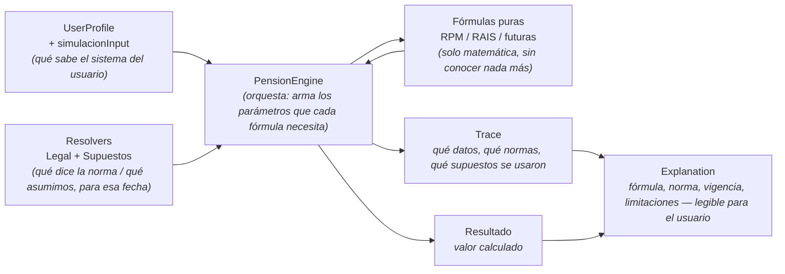
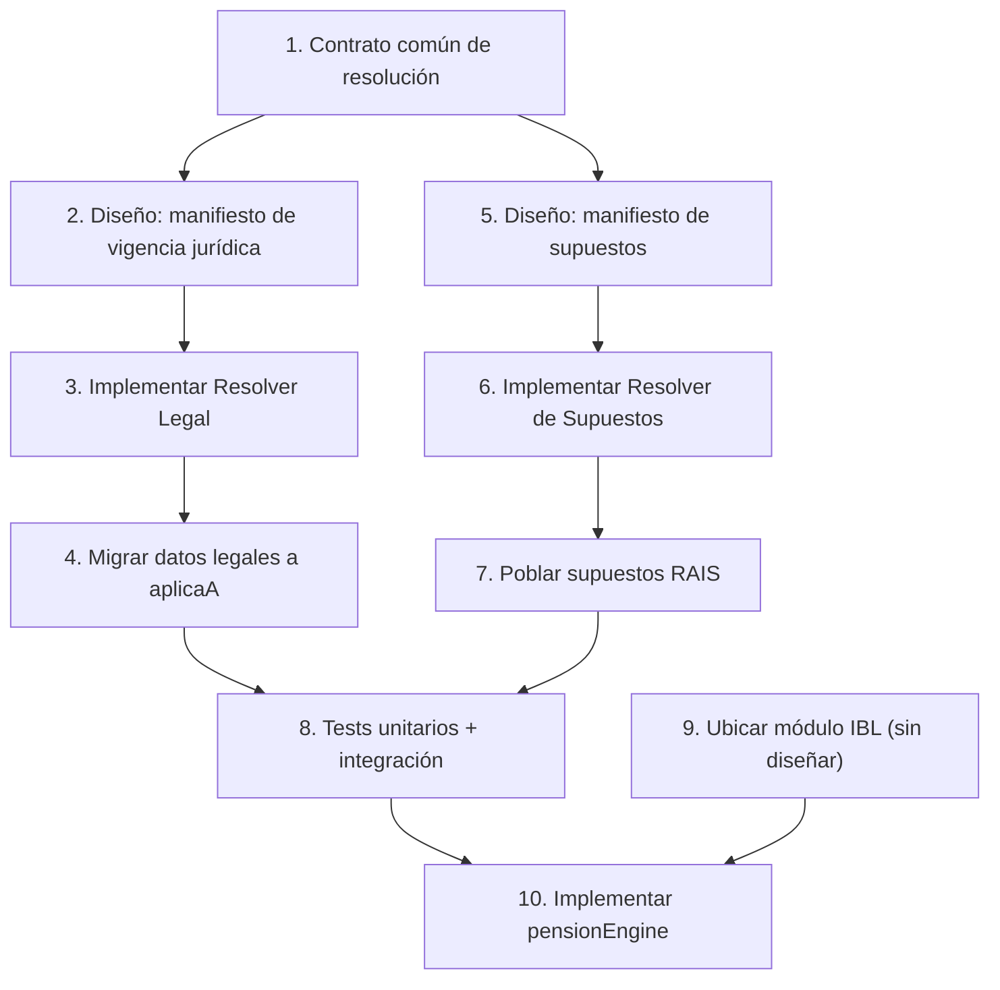
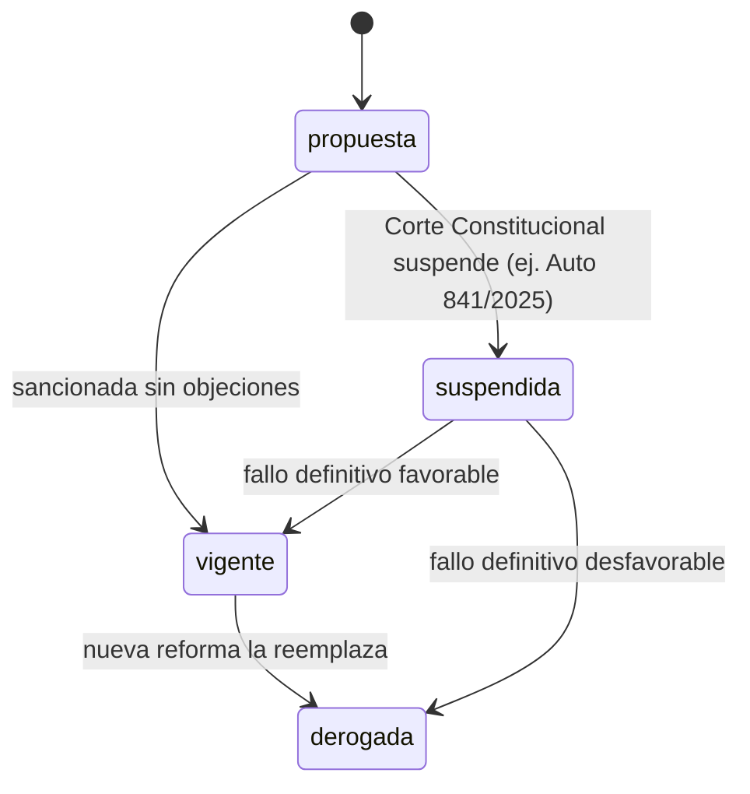
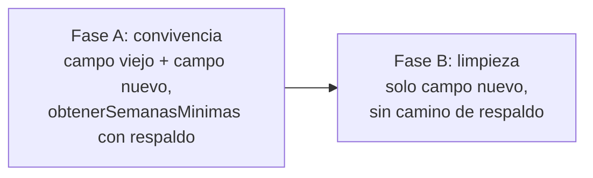
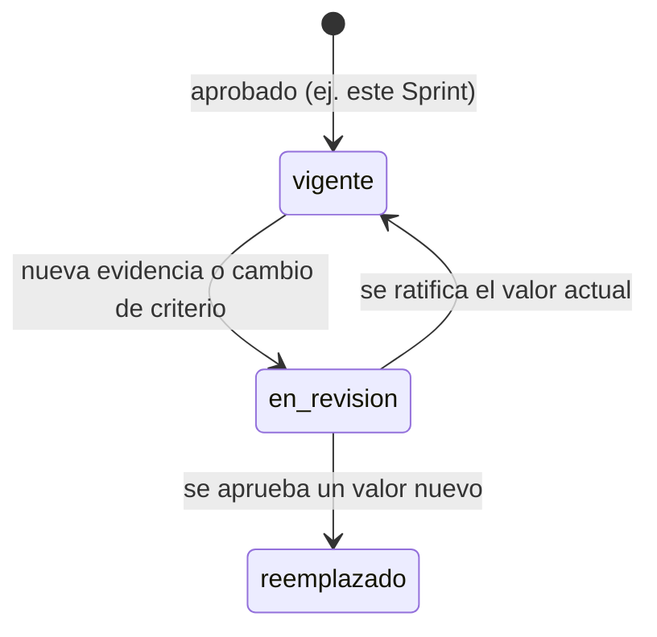
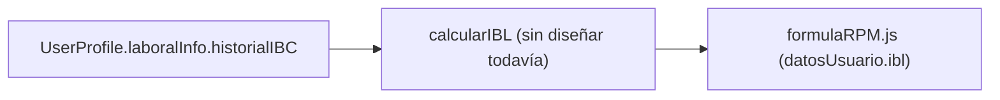

# Plan de implementación: prerrequisitos de `pensionEngine`

## Principios de Arquitectura de PensionLab

Estos principios guían todas las decisiones de arquitectura del proyecto, no solo
este plan. Se derivan de las decisiones ya tomadas a lo largo de Sprint 1 y quedan
registrados aquí como referencia permanente.

1. **Separación estricta entre lo obligatorio y lo asumido.** `data/legal` (normas)
   y `data/assumptions` (supuestos de modelo) nunca se mezclan — ni en manifiestos,
   ni en resolvers, ni en cómo se citan en `Explanation`. Un usuario siempre debe
   poder distinguir "esto lo dice la ley" de "esto lo asumimos nosotros".
2. **Las fórmulas matemáticas son puras.** Nada en `domain/formulas/` conoce
   fechas, archivos ni normativa — reciben parámetros ya resueltos y devuelven solo
   el resultado matemático. Es lo que permite probar, auditar y versionar el motor
   de cálculo sin depender de datos externos.
3. **Todo resultado debe ser trazable hasta su origen.** Cada norma o supuesto
   usado en un cálculo tiene un `id` citable, con fuente, artículo (o
   justificación) y vigencia — nunca un número "porque sí".
4. **El sistema falla explícito, nunca decide en silencio.** Ante ambigüedad,
   conflicto entre reglas, o datos faltantes, el comportamiento correcto es lanzar
   un error claro — nunca adivinar, promediar, ni devolver un valor por defecto sin
   decirlo.
5. **Las limitaciones y simplificaciones se declaran, no se ocultan.** Toda
   simplificación metodológica (ej. la proyección RAIS sin capital acumulado, el
   ancla fija en RPM) queda registrada como parte del resultado
   (`Explanation.limitaciones`), no solo en un documento que el usuario nunca ve.
6. **Una simulación es un snapshot inmutable y reproducible en el tiempo.**
   `Simulation` registra qué versión de normativa y de supuestos usó — cualquier
   cálculo pasado debe poder explicarse exactamente como se hizo, aunque la
   normativa haya cambiado después.
7. **RAIS es una proyección, nunca se presenta como cálculo definitivo.**
   Nomenclatura, estructura y nivel de confianza declarado lo refuerzan en cada
   capa, desde el nombre de la función hasta la etiqueta que ve el usuario.
8. **Los cambios de arquitectura se documentan antes de implementarse.** Ningún
   cambio importante de diseño se escribe primero en código — se diseña, se
   revisa, y solo después se construye.
9. **Se generaliza cuando hay evidencia real, no por anticipación.** Preferimos
   extraer una abstracción genérica cuando ya existen casos concretos que la
   necesitan (RPM/RAIS, hombre/mujer) — no construir para escenarios hipotéticos
   sin un segundo caso real que valide la forma (por eso el Motor de Reglas se
   difiere).
10. **Minimización y transparencia de datos personales.** Solo se recolecta lo
    estrictamente necesario para el cálculo, con consentimiento explícito, y con
    la menor exposición posible de datos sensibles.

## Diagrama general — todas las capas del sistema

Pensado para entenderse en menos de un minuto, antes de entrar en el detalle de los
diez pasos:

Lectura rápida: `UserProfile` y los `Resolvers` alimentan a `PensionEngine`, que
llama a las `Fórmulas` puras y arma dos cosas con el resultado — el `Resultado`
(el número) y el `Trace` (de dónde salió cada dato) — y el `Trace` es lo que permite
construir después la `Explanation` que ve el usuario.

> A partir de este documento, todo documento de arquitectura importante de
> PensionLab sigue este estándar: **Principios, Diagrama general, Objetivo, Diseño,
> Riesgos, Decisiones, Próximos pasos.** El resto de este plan conserva la
> estructura de 10 pasos ya aprobada (cada paso con su objetivo, archivos,
> dependencias, pruebas, riesgos, criterio de aceptación, migración y diagrama),
> que cumple el mismo espíritu sin forzar el nuevo formato sobre un documento que
> ya estaba aprobado.

## Objetivo

Definir, en orden, los prerrequisitos necesarios antes de implementar
`domain/pensionEngine/` — sin escribir código hasta completar el diseño de cada
uno, siguiendo el orden conceptual acordado: contrato común → manifiestos →
resolvers → migración de datos → supuestos poblados → pruebas → IBL ubicado →
`pensionEngine`.

## Diseño — mapa de dependencias entre los 10 pasos

Los pasos 2-4 (rama legal) y 5-7 (rama de supuestos) son independientes entre sí
una vez completado el paso 1 — podrían ejecutarse en paralelo. Se mantiene el orden
lineal aprobado por ser más fácil de revisar paso a paso.

### Paso 1 — Contrato común de resolución temporal y dimensional

| | |
|---|---|
| **Objetivo** | Documentar (JSDoc, sin lógica) la forma genérica que comparten internamente ambos resolvers: qué es una "entrada resoluble", qué forma tiene `dimensiones`, y el contrato del algoritmo de especificidad — antes de que exista ningún resolver concreto. |
| **Archivos** | Nuevo: `src/resolution/contracts.js` (fuera de `data/legal` y `data/assumptions`, para que ninguno "sea dueño" del contrato). |
| **Dependencias previas** | Ninguna — se apoya en el diseño ya aprobado en `resolver-legal-generico.md`. |
| **Pruebas** | No aplica — solo contrato/documentación, sin código ejecutable. |
| **Riesgos** | Diseñarlo sesgado hacia el caso ya conocido (semanas mínimas) en vez de genérico de verdad. Mitigación: validarlo contra el caso legal (con dimensiones) y el de supuestos (más simple) antes de aprobarlo. |
| **Criterio de aceptación** | El contrato cubre `vigencia`, `estadoJuridico`/equivalente, `campo`, `valor` y el nuevo `aplicaA`, sin campos ad-hoc por caso. |
| **¿Migración de datos?** | No. |

### Paso 2 — Diseño del manifiesto de vigencia jurídica

| | |
|---|---|
| **Objetivo** | Diseñar (documento, no código) cómo reemplazar `LINEA_DE_TIEMPO_VIGENTE` (hoy un arreglo hardcodeado en `data/legal/index.js`) por un manifiesto de datos que declare qué paquetes normativos existen y su estado (vigente / suspendida / derogada). |
| **Archivos** | Nuevo: `docs/tecnico/arquitectura/manifiesto-vigencia-juridica.md`. El archivo de datos real (`data/legal/manifiesto.json`) se crea en el Paso 3, junto con el resolver que lo consume. |
| **Dependencias previas** | Paso 1. |
| **Pruebas** | No aplica (diseño). |
| **Riesgos** | Sobre-diseñar contra casos hipotéticos de reforma en vez del caso real (Ley 2381 suspendida). Mitigación: diseñar contra ese caso concreto. |
| **Criterio de aceptación** | El diseño responde: "cuando la Corte falle sobre la Ley 2381, ¿esto requiere tocar código o solo datos?" — debe ser "solo datos". |
| **¿Migración de datos?** | No en este paso; es consecuencia del Paso 4. |
| **Diagrama** | |

### Paso 3 — Implementar el Resolver Legal genérico

| | |
|---|---|
| **Objetivo** | Construir `resolverValorLegal({campo, fecha, dimensiones})`, consumiendo el manifiesto (Paso 2), aplicando la regla de conflicto y "seleccionar el tramo o valor aplicable" para cronogramas. |
| **Archivos** | Nuevos: `data/legal/manifiesto.json`, `data/legal/resolver.js`. Modificado: `data/legal/index.js`. |
| **Dependencias previas** | Pasos 1 y 2. |
| **Pruebas** | Campo sin dimensiones (smlv); campo con dimensión simple; empate de especificidad con conflicto → debe fallar; fecha sin normativa → debe fallar explícito; paquete "suspendida" en el manifiesto → debe excluirse aunque el archivo exista. |
| **Riesgos** | Regresión silenciosa frente a `obtenerSemanasMinimas`/`resolverReglasVigentes` actuales. Mitigación: correr los mismos 6 casos ya verificados con node (1300 hombre, 1250/1225/1000 mujer por año, 1300 pre-2026, error en RAIS). |
| **Criterio de aceptación** | Esos 6 casos, contra fixtures en el esquema `aplicaA`, dan exactamente los mismos números. |
| **¿Migración de datos?** | No — se construye contra fixtures; los datos reales se migran en el Paso 4. |
| **Diagrama** | El ya aprobado en `resolver-legal-generico.md` (Resolver Legal + manifiesto + datos), sin cambios. |

### Paso 4 — Migrar los datos legales al esquema `aplicaA`

| | |
|---|---|
| **Objetivo** | Migrar `vigente-2026.json` de `semanasMinimasPensionHombre`/`Mujer` a `campo: 'semanasMinimasPension'` + `aplicaA: {sexo}`. Reducir `obtenerSemanasMinimas` a un wrapper real. Corregir "interpolar" en `data/legal/schema.js` (línea 48). |
| **Archivos** | Modificados: `data/legal/versions/vigente-2026.json`, `data/legal/index.js`, `data/legal/schema.js`, `data/legal/trazabilidad-normativa.md` (solo el nombre de campo, sin reabrir la validación de fuentes ya aprobada). |
| **Dependencias previas** | Paso 3. |
| **Compatibilidad durante la migración** | Dos fases: **Fase A (aditiva)** — entradas nuevas con `aplicaA` sin borrar las viejas; `obtenerSemanasMinimas` intenta primero el esquema nuevo y cae al viejo como respaldo. **Fase B (limpieza)** — una vez migrado todo y con tests en verde, eliminar entradas viejas y el respaldo. Ningún cambio atómico. |
| **Pruebas** | Los mismos 6 casos, ahora contra datos reales — regresión cero. Test específico de la Fase A verificando el respaldo. |
| **Riesgos** | El de mayor riesgo del plan — toca datos ya marcados "Validado" en `trazabilidad-normativa.md`. Mitigación: no cambiar ningún valor numérico, solo la forma. |
| **Criterio de aceptación** | Cero cambios numéricos; la matriz de trazabilidad sigue válida sin re-investigar fuentes. |
| **¿Migración de datos?** | **Sí — paso dedicado a eso.** |
| **Diagrama** | |

### Paso 5 — Diseño del manifiesto independiente de supuestos

| | |
|---|---|
| **Objetivo** | Igual que el Paso 2 pero para `data/assumptions`, con ciclo de vida propio ("vigente/en revisión/reemplazado", no lenguaje jurídico). |
| **Archivos** | Nuevo: `docs/tecnico/arquitectura/manifiesto-supuestos-vigentes.md`. |
| **Dependencias previas** | Paso 1 (independiente del Paso 2). |
| **Pruebas** | No aplica (diseño). |
| **Riesgos** | Copiar el ciclo de vida jurídico sin adaptarlo. Mitigación: nombrar los estados de forma explícitamente distinta. |
| **Criterio de aceptación** | El diseño explica qué pasa si se actualiza `rentabilidadEsperadaRAIS` de 3.5% a 4%, sin tocar código. |
| **¿Migración de datos?** | No. |
| **Diagrama** | |

### Paso 6 — Implementar el Resolver de Supuestos

| | |
|---|---|
| **Objetivo** | `resolverValorSupuesto({campo, fecha, dimensiones})` sobre `data/assumptions`, reusando el contrato del Paso 1, sin acoplamiento a `data/legal`. |
| **Archivos** | Nuevos: `data/assumptions/manifiesto.json`, `data/assumptions/resolver.js`. Modificado: `data/assumptions/index.js`. |
| **Dependencias previas** | Pasos 1 y 5. |
| **Pruebas** | Campo simple, fecha sin datos, conflicto de especificidad si aplica — sobre datos de supuestos. |
| **Riesgos** | Import cruzado accidental con `data/legal`. Mitigación: verificación explícita de que no haya imports entre ambos directorios. |
| **Criterio de aceptación** | Funciona con datos de prueba; cero imports de `data/legal`. |
| **¿Migración de datos?** | No — `supuestos-v1.json` sigue vacío hasta el Paso 7. |

### Paso 7 — Poblar los supuestos aprobados de RAIS

| | |
|---|---|
| **Objetivo** | Cargar en `supuestos-v1.json` los 3 valores aprobados (rentabilidad 3.5%, descuento 18.75%, horizonte 240) más los ids de `salarioConstante`/`continuidadCotizacion`. |
| **Archivos** | `data/assumptions/versions/supuestos-v1.json`. |
| **Dependencias previas** | Paso 6. |
| **Pruebas** | `resolverValorSupuesto` recupera exactamente los valores documentados en `trazabilidad-formula-RAIS.md`. |
| **Riesgos** | Bajo — riesgo de transcripción (ej. 0.35 en vez de 0.035). Mitigación: test contra el documento fuente. |
| **Criterio de aceptación** | Los 3 valores + 2 ids estructurales existen y son recuperables. |
| **¿Migración de datos?** | Sí — primera población de un archivo hoy vacío. |

### Paso 8 — Pruebas unitarias y de integración para ambos resolvers

| | |
|---|---|
| **Objetivo** | Probar que ambos resolvers conviven correctamente en un flujo conjunto (normas + supuestos a la vez), simulando lo que hará `pensionEngine`. |
| **Archivos** | `data/legal/resolver.test.js`, `data/assumptions/resolver.test.js`, un test de integración conjunto nuevo. |
| **Dependencias previas** | Pasos 3–7 completos. |
| **Riesgos** | Que se sienta redundante y se salte. Mitigación: su valor es la convivencia, no repetir lo ya probado. |
| **Criterio de aceptación** | Suite completa en verde, incluyendo los 18 tests de fórmulas ya existentes — cero regresiones. |
| **¿Migración de datos?** | No. |

### Paso 9 — Ubicar (no diseñar) el módulo de cálculo del IBL

| | |
|---|---|
| **Objetivo** | Reservar el lugar de la pieza faltante (bloqueo #1 identificado al diseñar los orquestadores) — sin definir fórmula ni supuestos todavía. |
| **Archivos** | Ninguno todavía. Futuro: `domain/formulas/calcularIBL.js` + `trazabilidad-formula-IBL.md`, mismo patrón que RPM/RAIS. |
| **Dependencias previas** | Ninguna de los pasos 1-8. Debe resolverse antes de `pensionEngine`. |
| **Pruebas** | No aplica todavía. |
| **Riesgos** | Que se implemente "de apuro" dentro de `pensionEngine`, saltándose el proceso de documentar-antes-que-código. Mitigación: tratarlo como su propio hito, con su propia trazabilidad. |
| **Criterio de aceptación** | Queda registrado como prerrequisito explícito en este plan. |
| **¿Migración de datos?** | No. |
| **Diagrama** | |

### Paso 10 — Implementar `pensionEngine`

| | |
|---|---|
| **Objetivo** | Construir `calcularPensionRPM.js` y `calcularProyeccionRAIS.js`, con los bloqueos del diseño anterior resueltos (IBL, supuestos poblados, decisión sobre el SMLV transitorio pendiente). |
| **Archivos** | `domain/pensionEngine/calcularPensionRPM.js`, `calcularProyeccionRAIS.js`. |
| **Dependencias previas** | Pasos 1–9 completos. |

No se detalla de nuevo aquí — ya se diseñó en el documento de orquestadores; este paso es donde ese diseño se implementa.

## Riesgos generales del plan

- El Paso 4 (migración de datos legales) es el de mayor riesgo — toca datos ya validados.
- El Paso 3 construye un resolver que no puede probarse contra datos reales hasta el Paso 4 — una ventana donde el resolver "funciona" solo en teoría/fixtures.
- El SMLV sigue bloqueado (`estadoJuridico: 'transitorio'`) durante todo este plan — la decisión de cómo manejarlo (permitir explícitamente vs. bloquear el cálculo) sigue pendiente y debe tomarse antes o durante el Paso 10.

## Decisiones

- Orden de 10 pasos aprobado tal como está, con la observación de que los pasos 2-4 y 5-7 son independientes entre sí y podrían paralelizarse si conviene.
- Migración del Paso 4 en dos fases (aditiva → limpieza), nunca atómica.
- El IBL se ubica pero no se diseña en este plan (Paso 9) — su diseño detallado es un hito aparte, antes del Paso 10.
- Estándar de documentación de arquitectura adoptado desde este documento en adelante: Principios, Diagrama general, Objetivo, Diseño, Riesgos, Decisiones, Próximos pasos.

## Próximos pasos

1. Comenzar por el Paso 1 (contrato común de resolución) cuando se apruebe iniciar la implementación.
2. Decidir, antes del Paso 10, cómo manejar el SMLV transitorio (pendiente desde el documento de diseño de orquestadores).
3. Diseñar en detalle el módulo de IBL como su propio hito, antes o junto con el cierre del Paso 9.
