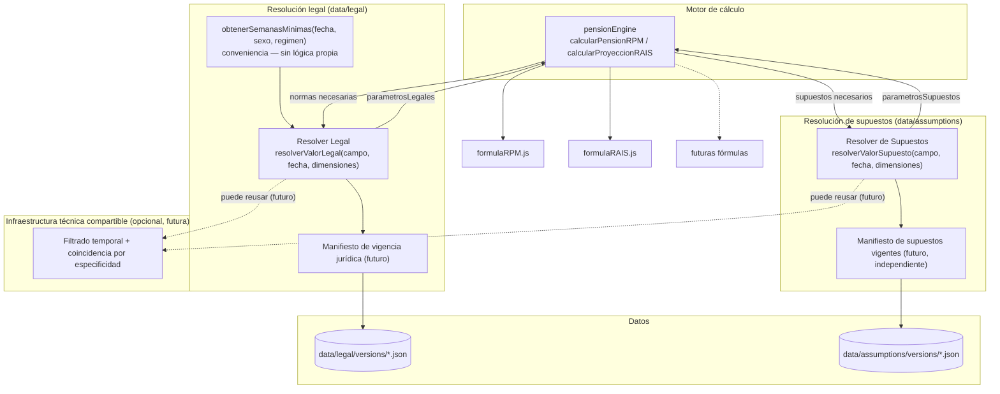
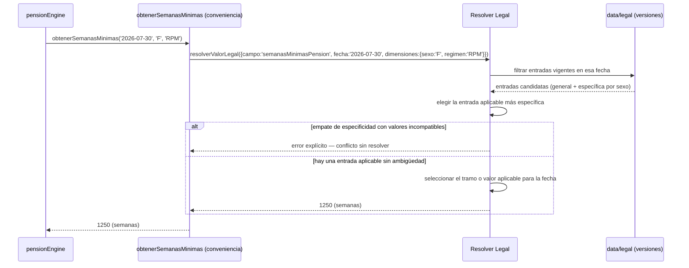
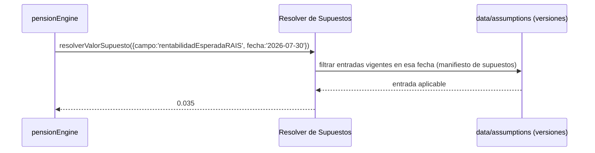

# Diseño: Resolver Legal, Resolver de Supuestos, y evaluación de Motor de Reglas

## Objetivo

Reemplazar el patrón actual —una función distinta por cada campo con reglas
especiales (`obtenerSemanasMinimas`)— por un mecanismo genérico de resolución,
manteniendo **separadas** la resolución de normas legales (`data/legal`) y la
resolución de supuestos de modelado (`data/assumptions`), y decidir si además se
necesita un Motor de Reglas como componente independiente, antes de escribir
`pensionEngine`.

## Diagrama general de arquitectura

`RL` y `RS` **no comparten fuente ni manifiesto** — cada uno resuelve contra su
propio directorio de datos y su propio ciclo de vigencia. Lo único que podrían
compartir en el futuro es una utilidad técnica de bajo nivel (filtrado por fecha,
elección de la entrada más específica) — eso es compartir *implementación*, no
compartir *identidad*: `pensionEngine` siempre sabe si está pidiendo una norma o un
supuesto, nunca los trata como la misma fuente.

## Flujo de datos

**Resolución legal** — caso con excepción por sexo, con la regla de conflicto y sin
usar el término "interpolar":

**Resolución de supuestos** — mismo patrón interno, fuente y manifiesto
completamente independientes:

## Responsabilidades de cada componente

| Componente | Responsabilidad |
|---|---|
| **Resolver Legal** (`resolverValorLegal`) | Dado `{campo, fecha, dimensiones}`, filtrar entradas de `data/legal` por vigencia/estado jurídico, aplicar la regla de conflicto, y devolver el valor aplicable (escalar, o el tramo aplicable si la norma define un cronograma). |
| **Resolver de Supuestos** (`resolverValorSupuesto`) | Lo mismo, pero sobre `data/assumptions`, con su propio manifiesto de vigencia de supuestos — no jurídico, no comparte ciclo de vida con las normas. |
| **`obtenerSemanasMinimas`** | Función de conveniencia. Delega íntegramente en `resolverValorLegal({campo:'semanasMinimasPension', fecha, dimensiones:{sexo, regimen}})`. No contiene lógica de resolución propia. |
| **Manifiestos** (futuros, no diseñados en detalle aquí) | El de vigencia jurídica decide qué paquetes normativos participan en la resolución legal; el de supuestos vigentes hace lo equivalente para `data/assumptions`. Son dos manifiestos distintos. |
| **`pensionEngine`** | Sabe qué campos necesita cada fórmula y con qué dimensiones pedirlos a cada resolver; nunca interpreta directamente un JSON de `data/legal` o `data/assumptions`. |
| **Fórmulas puras** | Sin cambios — siguen sin conocer resolvers, archivos, fechas ni normativa. |

## Decisiones de diseño

**1. Separación estricta entre Resolver Legal y Resolver de Supuestos.** Son dos
módulos con dos nombres distintos, dos manifiestos distintos y dos fuentes de datos
distintas. Esto refuerza, a nivel de resolución, la misma separación que ya existe en
`CalculationTrace` (`normasUsadasIds` vs. `supuestosUsadosIds`) y en la separación
`data/legal` = normas obligatorias / `data/assumptions` = supuestos de modelo, ya
aprobada anteriormente. Nada en el diseño permite tratar un supuesto como si tuviera
la fuerza de una norma, ni al revés.

**2. Las normas no producen valores matemáticos intermedios salvo mandato expreso.**
Cuando una regla define un cronograma (ej. la reducción progresiva de semanas para
mujeres), el resolver no "interpola" en el sentido matemático de estimar un punto
entre dos valores conocidos — **selecciona el tramo o valor que la norma misma
define como aplicable para esa fecha**. La diferencia no es solo de vocabulario: una
interpolación sugiere que el resolver podría inventar valores no contemplados
explícitamente por la norma; seleccionar un tramo dice, correctamente, que el
resolver solo elige entre valores que la norma ya fijó.

**3. Regla de conflicto — sin cambios respecto al diseño anterior, reafirmada
explícitamente:**
- Gana la entrada aplicable más específica (más dimensiones coincidentes).
- Si dos entradas tienen igual especificidad y valores incompatibles, el resolver
  **falla** — no elige por conveniencia.
- El resolver **nunca decide en silencio** cuál usar cuando hay ambigüedad real.

Esta regla aplica igual a `Resolver Legal` y a `Resolver de Supuestos` — es un
principio de comportamiento compartido, no una implementación compartida.

**4. `dimensiones` sigue siendo un objeto abierto**, no una lista fija de parámetros
— agregar una dimensión nueva (ej. `grupoAfiliado`) no cambia la firma de ningún
resolver.

**5. Motor de Reglas: se difiere, no se descarta.** Confirmado: no se construye como
componente independiente hasta que exista un segundo caso real de lógica
condicional compleja (ej. régimen de transición), donde la selección de reglas ya
no sea un simple match por especificidad sino una decisión con múltiples criterios
interactuando. La función de "elegir la entrada más específica" queda aislada dentro
de cada resolver precisamente para que, llegado ese momento, extraerla a un Motor de
Reglas propio sea una extracción de módulo, no una reescritura.

## Limitaciones

- Ninguno de los dos manifiestos (jurídico y de supuestos) está diseñado en detalle
  todavía — quedan como dependencia futura, mencionados pero no resueltos aquí.
- La migración de `semanasMinimasPensionHombre`/`Mujer` a un campo único con
  `aplicaA: {sexo}` sigue pendiente y sigue sin implementarse.
- `data/legal/schema.js` (ya implementado, no tocado en este turno) todavía usa la
  palabra "interpolar" en un comentario (línea 48) al describir el cronograma de
  semanas mínimas — queda como limpieza pendiente para cuando se migre el esquema,
  consistente con la corrección de terminología de este documento.
- Este diseño no resuelve régimen de transición ni ningún caso de lógica
  condicional compleja — es exactamente lo que se difiere al no construir el Motor
  de Reglas todavía.

## Próximos pasos

1. Decidir el orden de implementación de los prerrequisitos: Resolver Legal,
   Resolver de Supuestos, manifiesto de vigencia jurídica, manifiesto de supuestos,
   migración de `vigente-2026.json` al esquema `aplicaA`.
2. Diseñar en detalle (documento aparte, con el mismo estándar) el manifiesto de
   vigencia jurídica y el manifiesto de supuestos vigentes.
3. Solo después de lo anterior, comenzar la implementación de
   `domain/pensionEngine/`.
